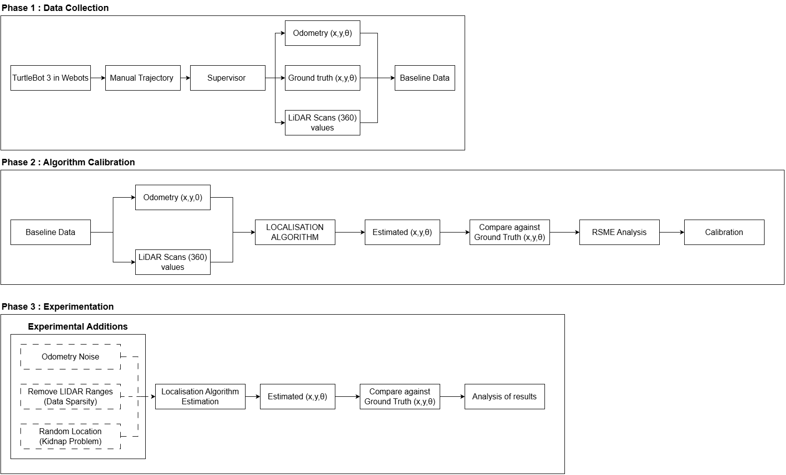
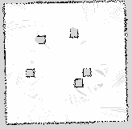

## Comparative Evaluation of EKF, Markov Grid, and AMCL with KLD-Sampling Localisation for Mobile Robots

---

## Overview

This branch provides the **dependencies** for all localisation algorithm implementations to perform OFFLINE PROCESSING:

- **AMCL with KLD-Sampling** → [AMCL branch](https://github.com/herish23/G23-IR/tree/amcl)
- **EKF (Extended Kalman Filter)** → [EKF branch](https://github.com/herish23/G23-IR/tree/ekf)
- **Markov Grid Localization** → [Markov branch](https://github.com/herish23/G23-IR/tree/markov)

All algorithms process the same baseline dataset collected in Phase 1, ensuring fair comparison.

---

## Dependencies

- **Python 3.9**
- **NumPy, OpenCV, Matplotlib, PyYAML**
- **Webots R2023b**

---
## Methodology Overview



The evaluation pipeline is broken into three phases:

---

### **Phase 1 — Data Collection** 

TurtleBot3 with built-in LiDAR capability was used in Webots Simulator as a supervisor to collect:
- Odometry data
- Ground truth poses
- LiDAR scans (0°–360°)

The robot was **manually controlled** using keyboard teleop to navigate the map while recording sensor data.

**Robot Platform:**
- **Robot:** TurtleBot3 Burger by Robotis
- **Simulator:** Webots R2023b
- **Sensors:** LDS-01 LiDAR (360° range readings), Wheel encoders

**Manual Trajectory Recording:**

1. Open Webots and load: `worlds/exp.wbt`
2. Run controller: `controllers/data_man/data_man.py`
3. Manually drive the robot using arrow keys (UP/DOWN/LEFT/RIGHT/SPACE)
4. Data is logged in real-time to: `data/sensor_data_clean.csv`

The controller records at 50 Hz (20ms intervals):
- Timestamp
- LiDAR ranges (360 points)
- Odometry (x, y, theta)
- Commanded velocities (v, w)
- Ground truth (x, y, theta from supervisor)

**Map Used for Data Collection:**



The 3.0 m × 3.0 m occupancy grid map (300 × 300 cells, 1 cm resolution) contains five cube-shaped obstacles and boundary walls, representing a structured indoor setting.

**Map files:**
```
maps/
├── epuck_world_map.pgm    # Occupancy grid map
└── epuck_world_map.yaml   # Map metadata (resolution, origin)
```


---

### **Phase 2 — Algorithm Calibration**

Algorithms were fed the collected odometry and LiDAR data from [`data/sensor_data_clean.csv`](data/sensor_data_clean.csv) to reduce error between estimated pose and ground truth. Each algorithm branch contains its own calibration scripts.

---

### **Phase 3 — Experimentation**

All optimised algorithms were tested under three controlled stress conditions:
- **Noise injection:** 10%-80% sensor noise levels
- **Data sparsity:** LiDAR down-sampled by factors of 2-32×
- **Kidnapped robot problem:** Random repositioning during motion

**Files Used in Experiments:**

**Noise configuration files** (located in `configs/`):
```
config_noise_10.yaml       # 10% sensor noise
config_noise_20.yaml       # 20% sensor noise
...
config_noise_80.yaml       # 80% sensor noise (8 levels total)
```

**Data sparsity files** (located in `data/`):
```
sensor_data_clean.csv       # Full 360° LiDAR (baseline)
sensor_data_sparse_2.csv    # 180 beams (every 2nd ray)
sensor_data_sparse_4.csv    # 90 beams (every 4th ray)
...
sensor_data_sparse_32.csv   # 11 beams (every 32nd ray) (5 levels total)
```

---

## Data Loaders

All algorithms use shared loaders from `libraries/localization_utils/`:

**Load clean sensor data:**
```python
from localization_utils import load_sensor_data

sensor_data = load_sensor_data('data/sensor_data_clean.csv')
```

**Load sparse sensor data:**
```python
from localization_utils import load_sparse_sensor_data

sensor_data = load_sparse_sensor_data('data/sensor_data_sparse_16.csv')
```

**Load map:**
```python
from localization_utils import load_map

map_info = load_map('maps/epuck_world_map.pgm', 'maps/epuck_world_map.yaml')
```

**Apply noise (used in Phase 3):**
```python
from localization_utils.noise_models import SensorNoiseModel
import yaml

# Load noise configuration
with open('configs/config_noise_60.yaml', 'r') as f:
    noise_config = yaml.safe_load(f)

# Apply noise to sensor data
noise_model = SensorNoiseModel(noise_config)
noise_model.add_lidar_noise(sensor_data['lidar_scans'])
```

---

## Repository Structure

```
.
├── controllers/data_man/         # Manual teleoperation data collector
├── data/                          # Baseline and sparse datasets
├── maps/                          # Occupancy grid map files
├── configs/                       # Noise configuration files
├── libraries/localization_utils/  # Shared data loaders and utilities
└── worlds/                        # Webots simulation world
```


